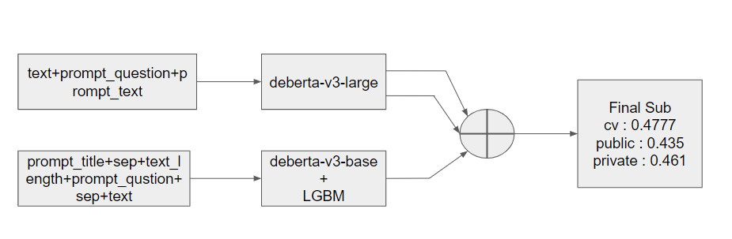

# Commonlit2  21th place solution
[link](https://www.kaggle.com/competitions/commonlit-evaluate-student-summaries/overview)

## Task
3~12年生の学生が書いたサマリー（要約）の質を評価する。ソーステキストのアイディアや詳細をどの程度表現できているか、使用されている言語がどの程度明確で正確で流暢であるか評価するモデルを構築する。サマリーはcontentとwordingの2つの尺度によって評価される。

 

### 評価指標
MCRMSE

 

## 解法

 

### key points
- Grouped-LLRD (Layer Wise Learning Rate Decay)
- Freezing layers ([reference](https://www.kaggle.com/competitions/commonlit-evaluate-student-summaries/discussion/433754#2405543))

 
 

### models
| exp | input_text | model | pooling | freezing | maxlen |
---- | ---- | ---- | ---- | ---- | ----
055 | text+prompt_question+prompt_text | deberta-v3-large | cls | no | 1024
084 | text+prompt_question+prompt_text | deberta-v3-large | cls | 4 layer close | 1024
004 | prompt_title+sep+text_length+sep+prompt_question+sep+text | deberta-v3-base+lgbm | attention | no | 512
